# Overview

This project evolves instances of Conway's Game of Life (GOL) with a variety of
interesting properties. What counts as "interesting" is defined by a suite of
[fitness goals](#fitness-goals), which examine videos of GOL simulations and
count which cells were alive or dead in particular frames.

The experiments explore different ways of evolving a GOL simulation, which are
represented as [genome configurations](#genome-configurations). In a series of
[genome experiments](#genome-experiments), configurations are evolved to
optimize each of the fitness goals. Then, in a series of [simulation
experiments](#simulation-experiments), these are compared head-to-head against
each other and a handful of predefined configurations to see which produce the
best GOL simulations.

# Genome Configurations

In this project, a genome configuration represents a way to evolve a GOL
simulation. It may restrict the space of possible designs explored, and
influence the process of searching through that space by managing mutations.
These configurations can be evolved or designed by hand. More details on how
these work [here](#genome-configurations) ***TODO: link***.

The rest of this section documents the predefined configurations used in this
project and the kinds of simulations they produce. The evolved configurations
use the same genome, so they produce similar initial populations (they differ
most in the mutation rates). To get a feel for the range of possible forms,
check out the `sample_initial_populations` directory, which includes 32
unevolved examples from each configuration. To see the customized mutation
rates in the evolved configurations, check out the `config_data.csv` file or
the per-experiment `best_config.txt` files in the `genome_experiments`
directory.

## Control

This is the simplest configuration, primarily used as a baseline to compare the
others against. For Control, the genotype is interpreted as a literal encoding
of the initial GOL board in its entirety, nothing more than a 64x64 grid of
simple on / off values for each cell. When making an initial population, each
grid is filled with random noise. For greater variety, the density of that
noise (that is, how many of the cells are alive) is also randomized.
Particularly high or low densities die out very quickly, but rather than
preclude those we let the genetic algorithm weed them out, effectively finding
the ideal range of densities by trial and error.

Examples of randomly generated, unevolved simulations using this configuration:

| 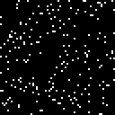 | 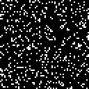 | 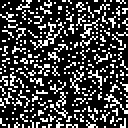 |
| :-: | :-: | :-: |
| 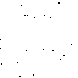 | 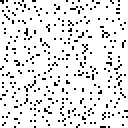 | 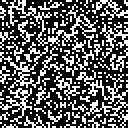 |

## Tile

With this configuration, the genotype is interpreted as a small "stamp" (an 8x8
grid of cells) that gets repeated to fill the whole 64x64 game board. In this
case, the stamp gets repeated edge-to-edge, filling the entire board with no
gaps or overlap. Optionally, every other copy of the tile may be mirrored,
which allows for different interactions between copies of the stamp along its
edges. This configuration narrows the search space to a very limited subset of
possible GOL scenarios, so many interesting designs simply aren't possible. On
the other hand, working with a tiny stamp makes it relatively easy to quickly
discover interesting cell patterns that get repeated over and over again. In
some cases, this is a quick and effective way to find very high-performing
solutions.

Examples of randomly generated, unevolved simulations using this configuration:

| 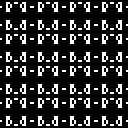 | 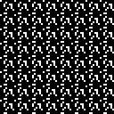 | 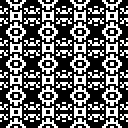 |
| :-: | :-: | :-: |
| 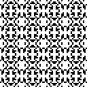 |  |  |

## Stamp

Like Tile, except with much more flexibility in how the stamps get placed. Gaps
and overlap between copies of the stamp are allowed. The stamp may be used
once, twice, repeated in a line, or repeated in a 2D grid like in the Tile
configuration. This configuration has many of the same benefits of Tile, except
it searches a larger space of possibilities. That means it might find better
solutions that aren't reachable in the Tile configuration, but it may take
longer to do so since it may look down dead ends that Tile avoids.

Examples of randomly generated, unevolved simulations using this configuration:

| 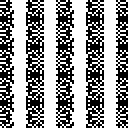 | 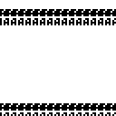 | 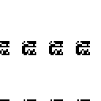 |
| :-: | :-: | :-: |
| 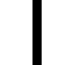 | 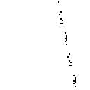 | 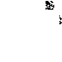 |

## Freeform

In this configuration, all genes are randomly generated and allowed to evolve
freely. In effect, this lets the algorithm choose between any of the above
configurations and even switch between them from one generation to the next.

Examples of randomly generated, unevolved simulations using this configuration:

|  | 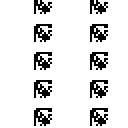 | 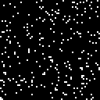 |
| :-: | :-: | :-: |
| 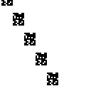 |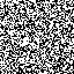 |  |

# Fitness Goals

There's no definitive way to judge the "interestingness" of a GOL simulation,
so this project provides some arbitrary fitness goals for the genetic algorithm
to satisfy. To judge the fitness of a GOL simulation, the code looks at the
video of that simulation, spot checking a few frames to count how many / which
cells are alive. Making really cool GOL simulations isn't the main purpose of
this project, so the goals are relatively simple. If you'd like to help make
more interesting goals for a future release, please contact the
[author](mailto:nate.gaylinn@gmail.com).

Below is a brief description for each fitness goal, along with the best
performing GOL scenario found for each goal, which gives a good visual
explanation of what that goal selects for.

## Still Life

Maximize the number of living cells that didn't change in the last frame.

## Explode

Start with as few live cells as possible and end up with as many as possible.
What matters here is not the absolute number of cells alive at the end, but the
ratio of living cells on the last and first frames.

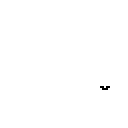

## Two Cycle

Maximize the number of cells oscillating between two states at the end of the
simulation.

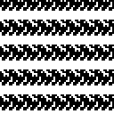

## Three Cycle

Maximize the number of cells oscillating between three states at the end of the
simulation.

## Left to Right

Start with the most living cells on the left and end with the most on the
right. More precisely, this considers the ratio of living cells on the left vs
right on the first and last frames. The result is the *product* of these two
ratios. That means a really good first frame can't offset having a really
crummy last frame, both need to be relatively balanced to get a good score.

## Symmetry

Maximize the number of live cells in the last frame with horizontal / vertical
mirror symmetry. The number of symmetrical cells is calculated for each
direction, and then added together to get the final fitness score. This means
simulations get credit for partial symmetry in one or both dimensions.

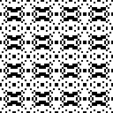

# Experiment Design

This project runs two different kinds of experiment, the results of which are
discussed [below](#results). To understand those results, it's important to
first understand the way they were made.

## Simulation Experiments

Each simulation experiment evolves a single GOL simulation to suit a fitness
goal. The main purpose is to compare how well different genome configurations
do at performing this task. For this reason, we test all the configurations
(both the evolved and predefined ones) on all fitness goals. Each configuration
is given five attempts to evolve a GOL simulation for 200 generations. The
overall performance is evaluated by looking at *median* fitness scores across
trials. This is important, since genetic algorithms rely on randomness and
performance can vary dramatically from trial to trial. Taking the median
smooths out this variance by dropping outliers (whose performance was probably
determined by luck more than the quality of the genome configuration).

The data collected from all of these experiments is captured in the
`simulation_experiments` directory, which contains the following:
- One sub-directory for each genome configuration tested. This includes
  configurations evolved for this fitness goal in all four variations (see
  [below](#genome-experiments)), configurations evolved for *other* fitness
  goals, and all the project's predefined genome configurations. Each of these
  directories contains the following:
    - `best_simulation_<score>.gif`: A video of the best simulation found
      during this expeimrent. The fitness score for this simulation is in the
      name.
    - `fitness.svg`: A chart showing the evolution of this GOL simulation,
      aggregating fitness across the full population and five trials.
    - `state.pickle`: A snapshot of the final experiment state, including the
      raw data used to generate the other files.
- `compare_default_to_evolved_rates.svg`: A comparison showing the effect of
  evolved global mutation and crossover rates vs. the default values.
- `compare_evolved_variations.svg`: A comparison of the four genome
  configuration variations evolved for this fitness goal. This shows the impact
  of using fitness vectors and fine-grain mutations.
- `compare_configs_cross_task.svg`: A comparison of the best configuration
  evolved for this fitness goal vs. the configurations evolved for *other*
  fitness goals. This shows how specialized the evolved solutions are.
- `compare_predefined_to_evolved_configs.svg`: A comparison of the predefined
  genome configurations to the best one evolved for this fitness function. This
  shows how different configurations do better / worse on particular fitness
  goals, and shows the value of evolving a configuration rather than designing
  it by hand.

## Genome Experiments

These are experiments used to evolve a genome configuration to suit a
particular fitness goal, with the hope of finding configurations that
outperform the predefined ones.

This project attempts evolving configurations in four different ways:
- **Without a fitness vector, using only global mutations.** This is like a
  traditional genetic algorithm, only the rate of mutation and crossover is
  evolved instead of using fixed default values.
- **Without a fitness vector, but with fine-grain mutations.** This lets the
  algorithm configure where mutations happen in the genome, in theory favoring
  variation where it's useful and avoiding it where it may cause harm. It also
  allows the algorithm to fix the value of a gene, locking in some aspect of
  the evolved simulation's behavior instead of letting it evolve.
- **With a fitness vector, using only global mutations.** This exposes some
  information about how well an individual's parent did on the fitness goal
  compared to its grandparent (better, worse, or the same?) and tune mutation
  rates accordingly. In theory, this could be used to adjust risk tolerance to
  either preserve innovation, or take chances out of desperation.
- **With both a fitness vector *and* fine-grain mutations.** A combination of
  the two previous variations. The mutation rate can be tuned globally and for
  each gene, conditionally based on parent performance.

For more details on the design of genome configurations and what these
variations really mean, see the documentation [here](#genome-configurations)
***TODO: link***.

Each genome experiment runs for 50 generations with a population of 32 genome
configurations. The fitness of each individual is evaluated by evolving GOL
simulations made with that configuration. That is, by running *another* genetic
algorithm experiment with five trials run for 200 generations each with a
population of 32 GOL simulations. The fitness of GOL simulations is decided by
one of the project's [fitness goals](#fitness-goals), but the fitness of a
genome configuration is based on how well the genetic algorithm was able to
learn. It uses the same fitness data that you see in the charts for each
simulation experiment, and looks for a combination of high overall fitness
scores and growth in fitness over time.

The data from these experiments is captured in the `genome_experiments`
directory. That directory contains one file, `confg_data.csv`, which puts all
the evolved configurations in one place for analysis with a spreadsheet tool.
There is also one subdirectory for each evolved variant, which contain the
following:
- `best_config.txt`: A human-readable version of the evolved configuration.
- `best_config.pickle`: A python-readable version of the evolved configuration
  created with the `pickle` module.
- `fitness.svg`: A chart showing the process of evolving the genome
  configuration. It tracks the median fitness of the genome configuration
  population over several generations.
- `best_trials.svg`: A chart showing the evolution of the best batch of
  simulations run in the course of this experiment. This corresponds to the
  point of highest fitness for the genome experiment.
- `best_simulation.gif`: A video of the best simulation found during the best
  batch of trials (captured in the previous chart).
- `state.pickle`: A snapshot of the final experiment state, including all the
  raw data used to generate the other files.

# Results

## Control Performance

The [Control](#control) configuration is able to adapt to fitness goals over
time and can produce interesting simulations, but only barely. Its performance
varies significantly depending on the fitness goal.

For goals like [Still Life](#still-life), Control isn't really able to get any
traction on the problem. Fitness improves quickly in the first few generations,
as the best of the randomly generated initial population are separated from the
worst. After that, though, fitness fluctuates wildly without any real upward
trajectory. This suggests that single-point mutations may help or hurt, but in
a chaotic way that doesn't allow for hill climbing.

Control does significantly better on the [Three Cycle](#three-cycle) and [Left
to Right](#left-to-right) fitness goals. Performance still fluctuates wildly,
but there does seem to be *some* upward trajectory leading to an ultimate
fitness score significantly higher than any found in the first few generations.

It's notable, though, that even in when Control was at its best, it was often
the *worst* compared to other genome configuraitons. The biggest takeaway here
is that the space of all possible 64x64 GOL simulations is quite big (there are
18 *quintillion* possible boards that size). It is possible to explore that
space by modifying the value of one cell at a time, but that's not a very
effective approach.

## Performance Impact of Genome Configurations

Different genome configurations provide different strategies for exploring the
space of GOL simulations, and some of these work *much* better than Control.

The [Tile](#tile) configuration is the most constrained of the project,
exploring a very small subspace of all GOL simulations. For some fitness goals
like [Explode](#explode), Tile is at an extreme disadvantage. It's able to
learn effectively over time, but its best solutions aren't very good. That's
because Explode penalizes having too many living cells in the first frame.
Whatever pattern of cells Tile evolves, it's forced to draw it 64 times,
filling the first frame with lots of living cells that hurts its score.

In other scenarios like [Symmetry](#symmetry) and [Still Life](#still-life),
Tile has a big advantage. The search space Tile considers is narrow, but it
happens to contain several strong solutions for those fitness goals. By
narrowing the search space so much, Tile is able to devote most of its
evolution time to fine-tuning one of these solutions to produce results
better than any other configuration tested.

The [Stamp](#stamp) configuration does reasonably well on all the fitness
goals, but it has a strong innate advantage for [Explode](#explode). Since it
can draw a stamp just one time, that provides a way to leave most of the
initial frame blank, while devoting most of its evolution time to finding a
small pattern that will expand in size the most.

The [Freeform](#freeform) configuration was able to switch between the Control
strategy and the Stamp strategy. You might suspect that would mean that it does
as well as the *best* of those two configurations, but actually its performance
typically fell somewhere *in between*. This seems to be for two reasons. First,
the control configuration often finds some not-terrible solutions in its
initial population, creating a local maximum that is hard to get out of via
mutation. Second, even when Freeform is using the Stamp strategy, it still
hedges its bets by occasionally flipping to the Control strategy, which is often
a waste of time.

## Divergent Strategies

Perhaps the most interesting example to consider is the [Left to
Right](#left-to-right) fitness goal. In that case, different configurations
found very different strategies for getting a high score.

The Control and Freeform configurations both found "cheaty" solutions that use
lucky crossover events from the initial population to find simulations that are
much more dense on the left than on the right. The result is that the left side
of the simulation has a very high live cell count at the beginning which
collapses almost immediately, while the right side persists and even manages to
grow to a modest degree.

Tile has no way to draw more live cells on one side of the board than another,
so it found a completely different solution. Like Freeform, it filled the board
with a dense pattern that quickly collapsed–except for where it interacted with
the edge of the board on the right hand side. The simulation can then bounce
back from the edge and expand to fill the right hand side.

Stamp got its highest score by drawing a small pattern just left of center that
wanders across the midline.

The best evolved configuration found a solution that was similar, but got a
much higher score. This is because of how much each stamp pattern expands,
starting small and filling a lot of space, but also because the pattern is
repeated three times instead of just once.

Although the evolved configuration was unable to repeat this performance in the
simulation experiments (randomness plays a big role here), one of the genome
experiments produced an even more dramatic result. By repeating the stamp in a
vertical line, the simulation is able to fill the left hand side pretty well on
the first frame then surge forth into the right hand side leaving behind a
trail of "debris" to fill the space.

The main takeaway here is that there's no one "best" way to evolve GOL
simulations. Restricting the search space makes it possible to evolve much
better solutions in limited time, but performance varies depending on the
fitness goal. A configuration performs best when it tightly constrains the
search space to a domain rich with good solutions for the fitness goal. Making
the search space more open ended can hurt performance, by wasting time
exploring dead ends, but making it too narrow can also hurt by making certain
good solutions unreachable. This is why there's an advantage to dynamically
evolving a strategy rather than just picking one that seems to fit the task at
hand based on human intuition.

## Evaluating Learning Ability

To evolve a genome configuration, the fitness of each individual is decided by
how well a genetic algorithm run in that configuration is able to learn and
produce high-fitness GOL simulations. That's a challenging thing to quantify.
In some cases, a configuration has very consistent performance, with results
from each trial taking a similar shape and settling at a similar max fitness
value:

In other cases, performance might vary wildly across trials, even producing
multi-modal results when the genetic algorithm might settle into one of several
local maxima:

The [Control](#control) configuration sometimes fails to get traction on a
problem at all, leading to very flat performance with high variance. More
remarkably, Control sometimes even evolves with a *downward* fitness
trajectory. This happens when a good solution can be found near to one of the
initial population, but without a clear path for improvement from there. In
this situation, random mutations tend to make the simulation *worse*. The
mutation rate is too high to preserve the best solution, so it slowly
deteriorates over generations instead of improving.

It would be good to explore existing research on how to measure the learning
ability of genetic algorithms, but for a first pass this project uses something
made up: a "weighted median integral." The general idea is to consider the
median fitness at each generation, which discards outliers and averages
performance across trials. Rather than looking at the maximum value, we sum up
the area under the median fitness curve. This not only prefers experiments that
produce higher fitness scores, but also rewards starting with a high score and
growing from there. To penalize scenarios where fitness *decreases* over time
(indicating partial success but poor learning ability), we discount the median
fitness scores from the first generation by 50%, and gradually increase to
giving full credit in the last generation.

Overall, this prefers genome configurations that produce several trials with
strong upward trajectories and high fitness scores.

## Performance of Evolved Genome Configurations

### Tuning Global Mutation and Crossover

By comparing the evolved genome configurations without a fitness vector or
fine-grain mutations to the Control configuration, we can see the impact of
evolving global mutation and crossover rates alone.

The evolved global mutation rates were sometimes much higher than the default
(0.001), while crossover rates were typically lower than the default (0.6).
Both varied significantly depending on the fitness goal.

| Fitness Goal  | Mutation rate | Crossover rate |
| :------------ | :------------ | :------------- |
| Still Life    | 0.0010        | 0.155          |
| Explode       | 0.0016        | 0.380          |
| Two Cycle     | 0.0034        | 0.097          |
| Three Cycle   | 0.0003        | 0.233          |
| Left to Right | 0.0055        | 0.698          |
| Symmetry      | 0.0070        | 0.006          |

How much did using evolved rates improve performance over the defaults? Not
much. For most fitness goals, the effect was negligible when looking at median
performance, though the higher evolved mutation rates did often result in
greater variance and better performing outliers.

For some fitness goals (Explode, Left to Right, Three Cycle), evolving
customized global mutation and crossover rates resulted in significantly better
performance.

Even though global tuning is sometimes valuable, its overall impact on
performance was relatively small. In all cases, enabling fine-grain mutation
configuration was much more significant. This actually suggests a confound in
the experiment design, since the ability to fix gene values is conflated with
the ability to tune per-gene mutation rates. It seems likely that fixing gene
values was more important than tuning mutation rates, but with the current
design there's no way to be sure.

### Fitness Vectors

Adding fitness vectors to the mix didn't seem to be particularly helpful, at
least not reliably so. Performance depends very much on the fitness goal in
question. For goals like Left to Right and Three Cycle, using a fitness vector
actually seemed to *hurt* performance. The variants with it disabled performed
better than the equivalent variation with it enabled.

For other goals, like Explode and Still Life, it seemed to provide some
advantage, thought not a lot.

On the Two Cycle goal the effect was pretty negligible.

The evolved rates did vary significantly depending on the fitness vector
setting. For crossover rates, there seems to be a weak pattern where the
most crossover happens when performance is declining, and the least crossover
happens when performance is stable.

| Fitness Goal  | Worse | Same  | Better |
| :------------ | :---- | :---- | :----- |
| Still Life    | 0.729 | 0.163 | 0.379  |
| Explode       | 0.396 | 0.915 | 0.459  |
| Two Cycle     | 0.518 | 0.121 | 0.225  |
| Three Cycle   | 0.233 | 0.101 | 0.278  |
| Left to Right | 0.730 | 0.201 | 0.312  |
| Symmetry      | 0.530 | 0.001 | 0.324  |

A similar pattern is visible for mutation rates, with the highest values
typically in the Worse column and the lowest typically in the Same column.

| Fitness Goal  | Worse  | Same   | Better |
| :------------ | :----- | :----- | :----- |
| Still Life    | 0.0089 | 0.0009 | 0.0042 |
| Explode       | 0.0086 | 0.0025 | 0.0019 |
| Two Cycle     | 0.0042 | 0.0021 | 0.0081 |
| Three Cycle   | 0.0087 | 0.0003 | 0.0032 |
| Left to Right | 0.0042 | 0.0021 | 0.0054 |
| Symmetry      | 0.0076 | 0.0054 | 0.0078 |

Intuitively, having higher rates of mutation and crossover when fitness is
declining makes sense. A drop in fitness means something valuable was lost in
the last breeding cycle. This individual may be competing with siblings that
still have that higher score, and is less likely than they are to reproduce. It
may be worthwhile to take a risk and hope more mutations will result in a
random improvements. It's unclear why mutation and crossover rates would be
lowest when the fitness trajectory is flat, though. Intuitively, that would
make more sense after a fitness *increase*, when some new innovation just
happened and needs to be preserved. 

In both cases, it's unclear how statistically significant this pattern is, or
what it means. It might be worthwhile to gather more data and investigate the
genealogical history for these experiments to better understand why these
values evolved and what impact (if any) they have in the context of an evolving
lineage.

Interestingly, when fine-grain mutations were added to the mix, this pattern
seemed to disappear and occasionally even *reverse* with the highest mutation
rates occurring when fitness is trending upwards.

| Fitness Goal  | Worse  | Same   | Better |
| :------------ | :----- | :----- | :----- |
| Still Life    | 0.0088 | 0.0001 | 0.0028 |
| Explode       | 0.0014 | 0.0063 | 0.0079 |
| Two Cycle     | 0.0027 | 0.0013 | 0.0029 |
| Three Cycle   | 0.0024 | 0.0047 | 0.0011 |
| Left to Right | 0.0098 | 0.0079 | 0.0065 |
| Symmetry      | 0.0083 | 0.0090 | 0.0076 |

Given that using a fitness vector had a very small impact with a lot of
variability, it's possible there isn't a meaningful pattern here, at least not
one that matters. It may make sense to abandon this concept all together and
focus on per-gene mutations instead.

### Fine-Grain Configuration

Evolving custom mutation behavior on a per-gene basis made an enormous
difference for performance. Using this method produced the best or second best
results for all fitness goals. Anecdotally, some previous runs did even better.
In some cases, also using a fitness vector helped, but it usually wasn't a very
significant effect. This section will focus on the data with fitness vectors
*disabled* since it is clearer to interpret.

In several cases, the evolved configurations used fixed genes to constrain the
search space. In most goals, the stamp gene was fixed to true, forcing the
genetic algorithm to work with an 8x8 grid of cell values rather than the full
64x64 used by the Control configuration. This makes sense, since Control was
always the worst at learning and often had the worst absolute fitness score,
also. For some reason, the configuration evolved for the Explode fitness goal
did *not* force the stamp gene, which is surprising because the best solutions
all had that gene set to true. That could be a matter of luck.

For the Two Cycle and Three Cycle fitness goals, the evolved configuration
forced the repeat mode to 2D, creating simulations more like the Tile
configuration that performed very well. The configurations evolved for Symmetry
forced the repeat_offset value in a way that encouraged vertical stripes to
appear in the initial population, a good reliable way to produce symmetrical
patterns. These seem like great examples of the evolved configuration capturing
useful information about how to find good solutions to a fitness goal.

The evolved mutation rates varied greatly depending on the fitness goal, and
from gene to gene. Often the mutation rates were *much* higher than the
default, especially for the "configuration genes" that change how the seed gene
is interpreted by repeating, shifting, or mirroring the pattern there. In
theory, this might mean the evolved configurations have found a search strategy
that involves prioritizing some kinds of relatively safe or powerful mutations
over others in a task-aware way. However, it's hard to be sure this is a real
effect without further analysis.

### Task Specialization

Evolving a genome configuration to suit the fitness goal often produces better
results, but is the algorithm really learning something meaningful about the
task at hand? The data suggests the answer is yes, but perhaps weakly so. The
configuration evolved for a task was always *among* the best performers, but
occasionally configurations evolved for other tasks did almost as well or even
better. When this happened, the best-performing configuration generally had a
fitness score with high variance, meaning that configuration might be less
*reliable* at producing good results than the one evolved to the task at hand.

There's no reason why the evolved configurations should necessarily do best on
the task they were trained on. It's possible there's one configuration that's
simply better than the others on all tasks, it just happened to be discovered
when training on one specific task. That *doesn't* seem to be the be the case
here. No one configuration was consistently the best, but the ones evolved for
Three Cycle and Two Cycle did seem to generalize better than the others. They
were often close runners up and occasionally even won for tasks they weren't
evolved for. This is clearest for the Still Life fitness goal:

It would also be possible for the evolved configurations to be generally better
than the predefined ones, but only different from each other in random and
meaningless ways. That doesn't seem to be the case. For one thing, the
configuration evolved for a task was always among the best at that task.
Furthermore, the evolved configurations rarely fixed gene values, but when they
did, it was in a way that intuitively fit the problem at hand (see
[above](#fine-grain-configuration)).

### Overall Performance

Considering the predefined configurations:
- Control was usually the worst performing configuration, across all tasks.
- Tile typically performed very well or very poorly, depending on the fitness
  goal.
- Stamp was the most versatile, performing decently well on every goal and
  sometimes even coming out on top.
- Freeform tended to follow the strategy of either Control or Stamp, and
  typically did *worse* than either of those alternatives.

The evolved configurations were strong contenders for *every* fitness goal,
getting first or second place. Most often they adopted a Stamp- or Tile-like
strategy, and earned fitness scores very close to the best of those predefined
configurations, sometimes much better.

Below are the best performing simulations for every fitness goal and
configuration. The fitness score is listed in parentheses.

#### Still Life

| 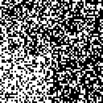   Control (382) | 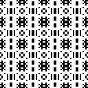   Tile (796!) | 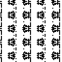   Stamp (495)|
| :-: | :-: | :-: |
| 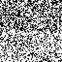   **Freeform (381)** | 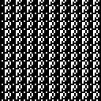   **Evolved (693)** | |

#### Explode

| 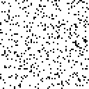   Control (115) | 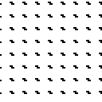   Tile (143) |    Stamp (1787!) |
| :-: | :-: | :-: |
|    **Freeform (1175)** | 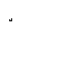   **Evolved (1714)** | |

#### Two Cycle

| 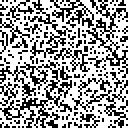   Control (193) | 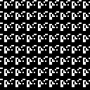   Tile (26) | 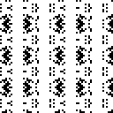   Stamp (448) |
| :-: | :-: | :-: |
| 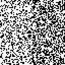   **Freeform (188)** |    **Evolved (572!)** | |

#### Three Cycle

| 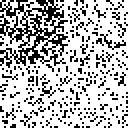   Control (185) |    Tile (128) | 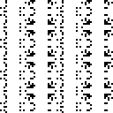   Stamp (416!) |
| :-: | :-: | :-: |
| 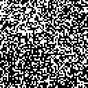   **Freeform (178)** |    **Evolved (320)**| |

#### Left to Right

| 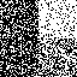   Control (608) | 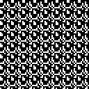   Tile (184) | 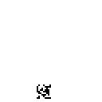   Stamp (3042) |
| :-: | :-: | :-: |
| 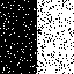   **Freeform (1741)** |    **Evolved (24300!)** | |

#### Symmetry

| 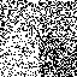   Control (117) |    Tile (920!) | 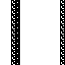   Stamp (307) |
| :-: | :-: | :-: |
| 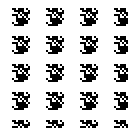   **Freeform (246)** | 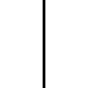   **Evolved (580)** | |

# Conclusions

This project is more of a proof of concept than a work of science. As such, it
didn't have a formal hypothesis, only the idea that using a genetic algorithm
to design a genetic algorithm might produce better performance than designing
one by hand. Building and analyzing this project was very helpful in
understanding that problem space better. Although further work is needed to
make any of these claims definitively, this project suggests the concept is at
least feasible.

## Lessons Learned

- Constraining the search space is a powerful way to improve the performance of
  a genetic algorithm. Finding the *right* subset of the search space to fit
  the problem is critical, however. For example, the tightly constrained
  [Tile](#tile) configuration was often among the best or the worst performing,
  depending on the fitness goal. Being able to automatically find a good subset
  of the search space would certainly be valuable.
- Despite not being biologically realistic, this two-tiered nested evolution
  does seem to be an effective way to evolve the behavior for a genetic
  algorithm. With the aid of GPU parallelization, it is fast enough to be
  practical.
- The evolved configurations sometimes outperformed the best of the
  hand-designed alternatives, but more often did about the same or slightly
  worse. One reason for this may be that the space of possible configurations
  was very limited, and already well covered by the predefined configurations.
  Using a genetic algorithm to explore the space worked, but there were no
  options very different or much better than the defaults. This approach would
  probably be more interesting in a much broader search space, that wouldn't be
  feasible to explore by hand. Giving the genome experiments longer to evolve
  might also make a difference (they only got 50 generations vs. 200 for
  simulation experiments)
- This project tested too many ideas at once. That was intentional. The purpose
  was to throw a bunch of things at the wall to see what stuck. It produced a
  lot of weak, suggestive evidence, but a more compelling demonstration would
  require isolating individual factors and gathering much more data about them.
  Fixing gene values seemed to have most profound effect, so that might be a
  good first target. The effects of evolved mutation rates were much more
  subtle. There may be something useful in there worth pursuing, but as a
  secondary target.
- It's unclear whether the fitness vector idea is worth pursuing at all. The
  fact that patterns appeared in the evolved mutation and crossover rates
  suggests there was selective pressure at play here. However, the overall
  impact was small and inconsistent, so it's not clear what value it adds. It
  certainly does add a lot of complexity to the code and analysis, though.
- This project ran all simulation experiments for five trials to reduce
  variance, which proved very effective at getting the genome experiments a
  clear signal to learn from. This project did *not* give genome experiments
  multiple trials, but it probably *should* have, because they were also highly
  variable from run to run. Time constraints were the only reason for this. If
  the project were simplified (for instance, by evolving only one genome
  configuration for each fitness goal rather than four variations), it would be
  feasible to add this in without ridiculously long run times.
